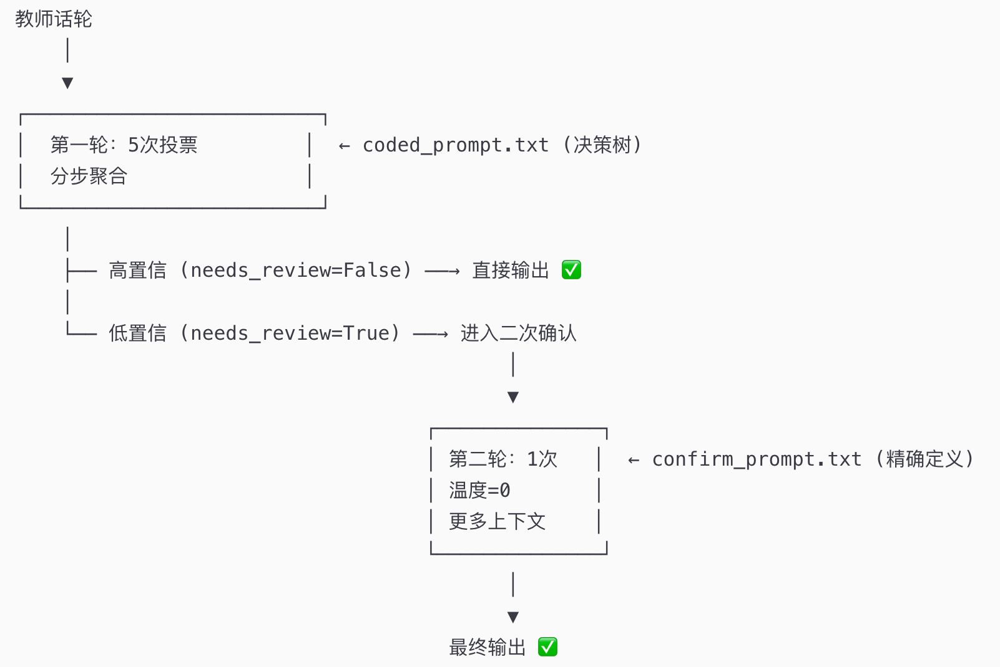

## 基于LLM课堂对话自动分析
1. 关注教师的话语，基于APT框架（academically productive talk);
   * Elaboration: Say more, Revoice
   * Reasoning: Press for reasoning, Challenge
   * Listening: Restate
   * Thinking with others: Agree/disagree, Add on, Explain other
2. 分析逻辑：先判断讲话者（teacher, student), 再判断对谁讲话（同一位学生，还是多位学生），最后判断属于哪一类APT(elaboration, reasoning, restate, thinking with others);
   * Step 1: 教师是在对【同一个学生】继续追问，还是在邀请【其他学生】参与？
   * Step 2: 如果是对同一学生——press for reasoning, challenge, revoice, say more
   * Step 3: 如果是对其他学生——agree/disagree, explain others, restate, add on
4. Say more与多个APT类别重复了，可采用的方案：
   * 增加Say more的说明；
   * 增加较高阶（thinking with others）案例；
   * 把当前话论输入llm，利用情景信息提高准确性；
5. 通过多视角投票来确定最终的编码结果：
   * 视角一：标准 Prompt，要求精确分类（偏低温度）。 
   * 视角二：修改 Prompt，得到高召回结果。 
   * 合并：对于两个视角结果不一致的话轮，单独用第三个 Prompt 进行仲裁，只准选择一个代码。
6. 两轮分析思路 （层级决策树、分布聚合、二次确认） 《- chain-of-though, self-consistency, ensemble
   * 第一轮 (决策树 prompt): 快速决策树判断 → 大部分话轮直接出结果  （needs_review=True）
     * Type A 顺序：revoice → challenge → press → say_more。
     * Type B 顺序：explain_others → agree_disagree → restate → add_on。
   * 第二轮 (精确定义 prompt): 聚焦型确认 → 给出最终判断

## 整体思路1 （准确率一般）

## 整体思路2
┌─────────────────────────────────────────────┐
│  Stage 1: Trigger + Addressee Detection     │
│  Input: 上下文窗口 + 当前教师话轮            │
│  Output: {trigger, addressee, evidence}      │
│  Prompt: 专注于"是不是follow-up"+"对谁说"   │
│  Few-shot: 大量trigger/non-trigger边界案例   │
└──────────────┬──────────────────┬───────────┘
               │                  │
      addressee =          addressee =
        same_student         other_student
               │                  │
               ▼                  ▼
┌──────────────────────┐  ┌──────────────────────┐
│  Stage 2A: Type A    │  │  Stage 2B: Type B    │
│  Coding              │  │  Coding              │
│                      │  │                      │
│  Input: 上下文 +      │  │  Input: 上下文 +      │
│  已确认的addressee    │  │  已确认的addressee    │
│                      │  │                      │
│  Codes:              │  │  Codes:              │
│  - revoice           │  │  - explain_others    │
│  - challenge         │  │  - agree_disagree    │
│  - press_for_reason  │  │  - restate           │
│  - say_more (默认)   │  │  - add_on (默认)     │
│                      │  │                      │
│  Few-shot: 10-15个   │  │  Few-shot: 10-15个   │
│  Type A 专用案例     │  │  Type B 专用案例     │
└──────────────────────┘  └──────────────────────┘
               │                  │
               ▼                  ▼
┌─────────────────────────────────────────────┐
│  (可选) Stage 3: Confidence Review          │
│  仅对低置信度案例进行复查                     │
└─────────────────────────────────────────────┘

## 准确率记录
测试数据：121 个教师话轮，其中 99 个包含 APT move，22 个不包含 APT move。`restate` 和 `explain_others` 在该数据集中的 gold support 为 0，因此对应 F1 为 N/A，不参与 Macro F1 的平均。

| 版本 | 主要思路 | Macro F1 | 二分类 F1 | 错误话轮 | 主要问题 |
| --- | --- | ---: | ---: | ---: | --- |
| v3 | 单次预测 + 条件复查；一次判断 trigger、addressee 和 code | 0.586 | 0.851 | 50 | Trigger 错误较多，`revoice` 和 `challenge` 误报明显 |
| v5 | 分阶段判断：Stage 1 判断 trigger/addressee，Stage 2 按 Type A/B 分类，Stage 3 复查高风险结果 | **0.654** | 0.927 | 35 | 当前最佳基线；`revoice`、`challenge` 和部分 `add_on` 边界仍不稳定 |
| v6 | 多 code + 结构化 confidence；收紧 discussion continuation 和 addressee 判定 | 0.522 | 0.841 | 57 | 过度收紧导致大量 `add_on` 漏检，Trigger Recall 降至 0.747 |
| v7 | 在 v6 基础上恢复部分 discussion continuation，保留多 code 和复查失败兜底 | 0.598 | 0.906 | 38 | 比 v6 改善，但仍低于 v5；`add_on` Recall 为 0.481，`revoice` F1 为 0.222 |

### 版本分析

* **v3**：作为单次预测基线，二分类 F1 为 0.851，但 50 个话轮出现错误，主要损失来自 trigger 判断和 `revoice`/`challenge` 边界。
* **v5**：将任务拆成 trigger/addressee、Type A/Type B 分类和条件复查，Macro F1 达到 0.654，是目前表现最好的版本。二分类 F1 为 0.927，说明分阶段结构有效改善了整体触发判断。
* **v6**：首次正式支持多个 code，并使用结构化 confidence 控制复查；但 Stage 1 对 discussion continuation 过于严格，`add_on` Recall 只有 0.222，导致 Macro F1 降至 0.522。
* **v7**：恢复了部分 active discussion 逻辑，并加入 Stage 3 失败时保留 Stage 2 结果的兜底。错误话轮降至 38，Macro F1 回升至 0.598，但仍未超过 v5。

当前后续优化方向是以 v5 的高召回 trigger 判断为基础，保留 v7 的多 code 和失败兜底，同时针对 `add_on`、echo-confirmation 类型 `revoice`、`press_for_reasoning` 的 reasoning 问句进行局部修正。

### v8泛化表现
四个文件已经全部完成 v8 评估。结果说明：v8 在 Chris Moon 上表现不错，但跨课堂泛化明显下降。
文件	教师话轮	Binary F1	Macro F1	错误话轮
Paper 1 Marking Conference	82	0.615	0.324	27
Natalie Chan Lesson 1	82	0.807	0.669	15
STFACYTSS Charity	30	0.526	0.214	11
Timothy Lim Lesson 1	26	0.720	0.403	

